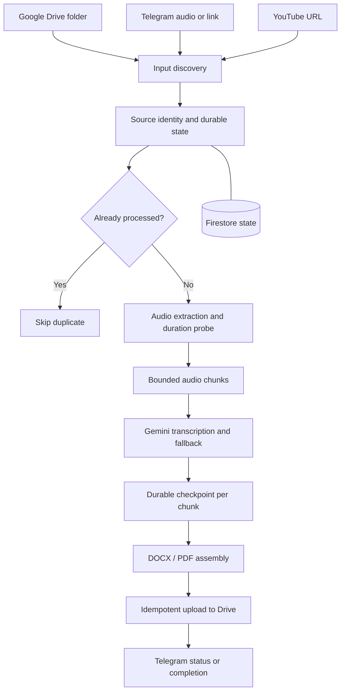

# Cloud AI Transcriber

**An AI-assisted, cloud-oriented audio transcription pipeline using Python, Gemini, Google Drive, Telegram, and Google Cloud.**

This repository is a **portfolio-oriented, sanitized snapshot** of a personal engineering project. It illustrates how a real workflow was designed, automated, tested, and made resilient. Operational history, private resource identifiers, production-only runbooks, and credentials are intentionally excluded.

> **Privacy and scope:** No production credentials, customer recordings, personal transcripts, deployment secrets, or private infrastructure configuration are included. This is a technical reference implementation, not a public transcription service or an active production deployment.

## What problem does it solve?

Long class recordings and voice messages take time to transcribe, summarize, and organize. This project connects the steps into a recoverable pipeline: ingest media, extract and normalize audio, transcribe manageable chunks with Gemini, assemble documents, store outputs in Drive, and report progress through Telegram.

## How it works



The system supports a legacy local run mode and a one-shot execution mode designed for Cloud Run Jobs, with Firestore-backed state and coordination for cloud workflows.

## Engineering highlights

- **Multi-source ingestion:** Drive, Telegram attachments, and YouTube links.
- **Memory-bounded processing:** FFmpeg extracts and processes audio in small chunks instead of loading full recordings into memory.
- **Resumability:** Durable per-chunk checkpoints support recovery after interruptions.
- **Idempotency:** Source-derived identities and Drive upload safeguards reduce duplicate work and output.
- **Fallbacks and quality checks:** Retry policy, model fallback, silence detection, and selective quality recovery.
- **Operational visibility:** Structured status, Telegram commands, and a separate read-only dashboard implementation.
- **Automated validation:** Python unit tests, Firestore emulator integration checks, CI, and container builds.

## Technology

Python 3.12 · Google Gemini · Google Drive API · Telegram Bot API · Google Cloud Run Jobs · Cloud Scheduler · Firestore · Secret Manager · FFmpeg · yt-dlp · Docker · GitHub Actions.

## Repository map

| Location | Role |
| --- | --- |
| `main.py`, `phase12_entrypoint.py` | Orchestration and run modes |
| `drive_*.py`, `telegram_*.py`, `youtube_ingest.py` | Input, output, and notifications |
| `gemini_transcriber.py`, `quality_rescue_runtime.py` | Transcription and quality handling |
| `state_backend.py`, `state_store.py` | Durable state, checkpoints, and leases |
| `dashboard_app.py`, `dashboard/` | Read-only job-status interface |
| `tests/` | Automated regression and integration tests |
| `docs/` | Portfolio architecture and security notes |

## Try the project locally

Prerequisites include Python 3.12, FFmpeg/FFprobe, and your **own** Google Drive OAuth application, Gemini API key, and Telegram bot. Copy `.env.example` to `.env`, provide your own credentials and folder IDs, and install dependencies:

```bash
python -m venv .venv
python -m pip install -r requirements.txt
python -m unittest discover -s tests -v
```

A local run requires valid OAuth authorization and the appropriate environment values. **Do not put credentials in Git or share them in issues.** Cloud deployment requires independent IAM, secret, Firestore, and scheduler configuration not included in this portfolio snapshot.

## Testing and security

CI validates Python syntax, unit tests, the Firestore emulator integration path, and container builds. The repository excludes production-only operational details and should be treated as a **code demonstration**, not a guarantee that a public deployment is secure by default.

See [Architecture](docs/ARCHITECTURE.md), [Security model](docs/SECURITY_MODEL.md), and [Security policy](SECURITY.md).

## My contribution

I defined the use case and operating requirements, designed the workflow and expected behavior, coordinated AI-assisted development, tested real cases, investigated failures, and validated cloud operation. AI coding assistants helped implement the software; this is not a claim that every line was hand-written.

---

**Portfolio version:** Independently curated from a private project. It deliberately has a fresh Git history and does not expose the original project's development discussions, production incident logs, or secrets.
